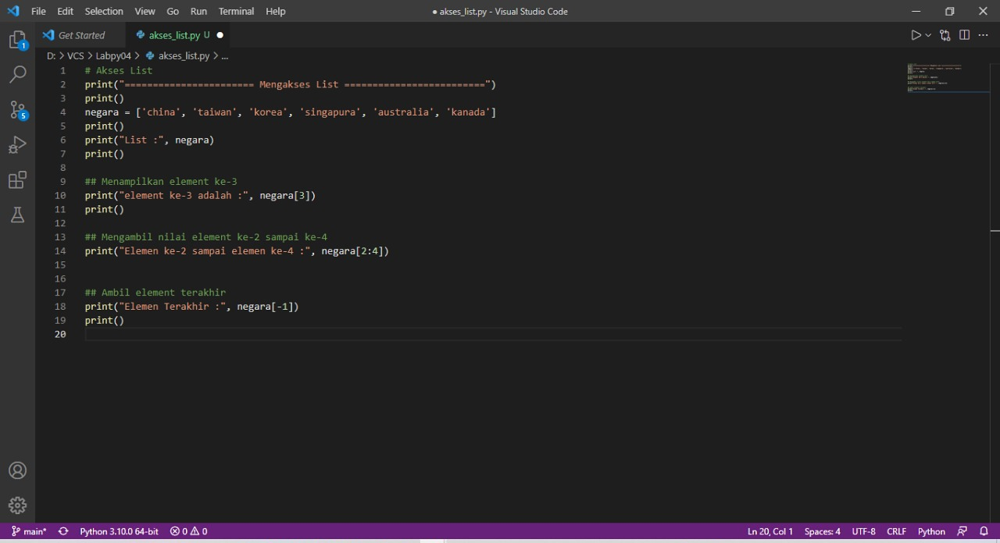
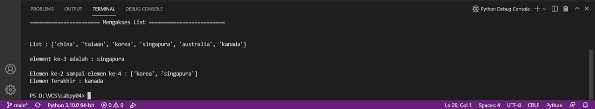
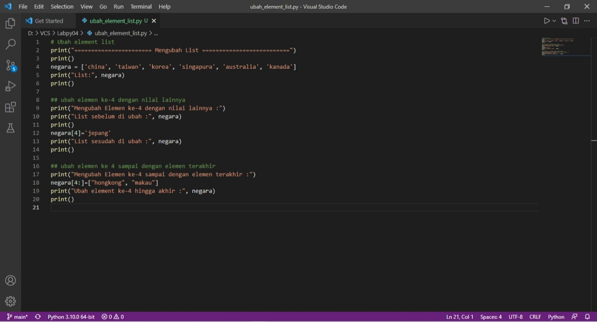
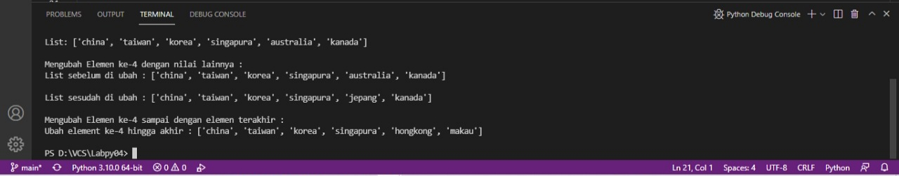
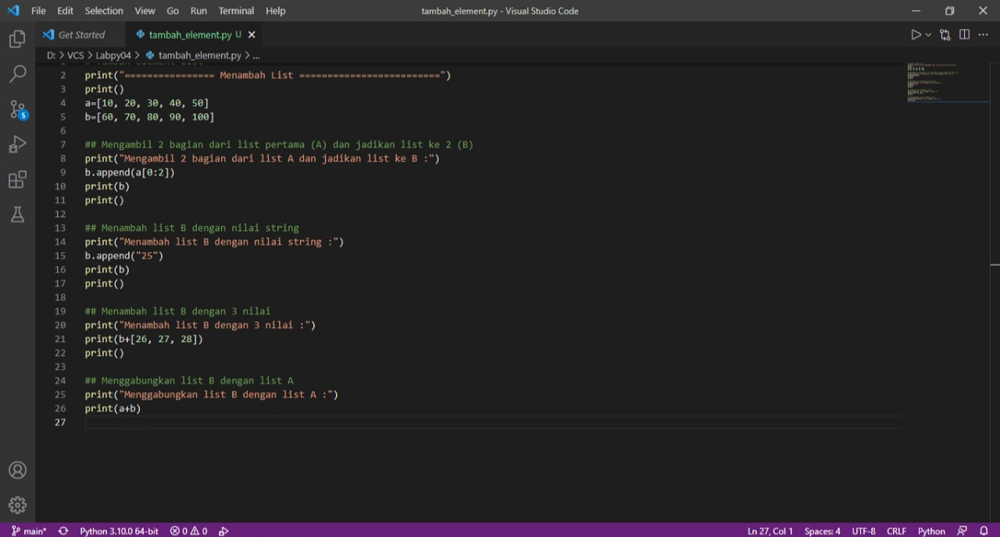
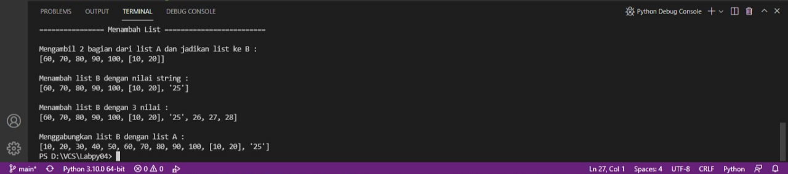
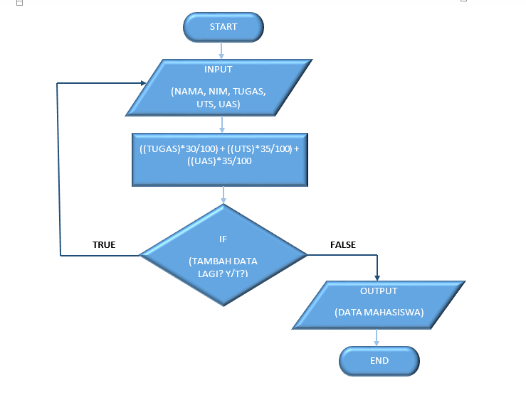
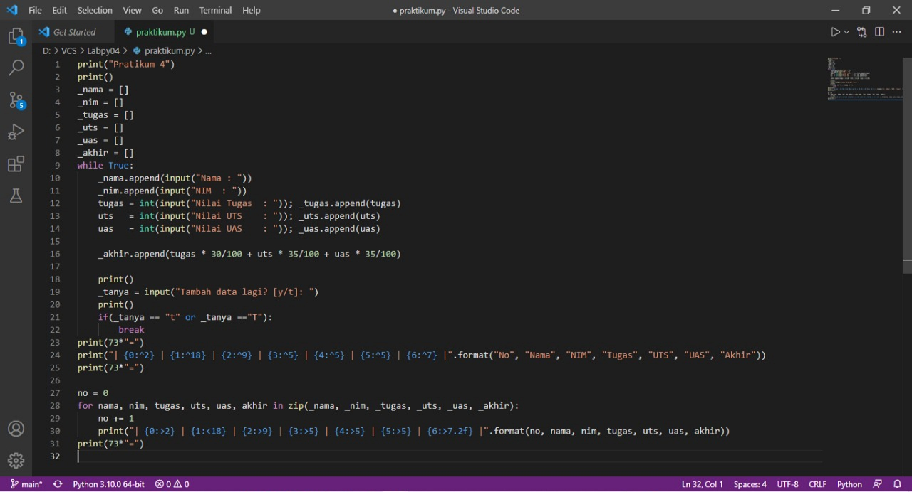
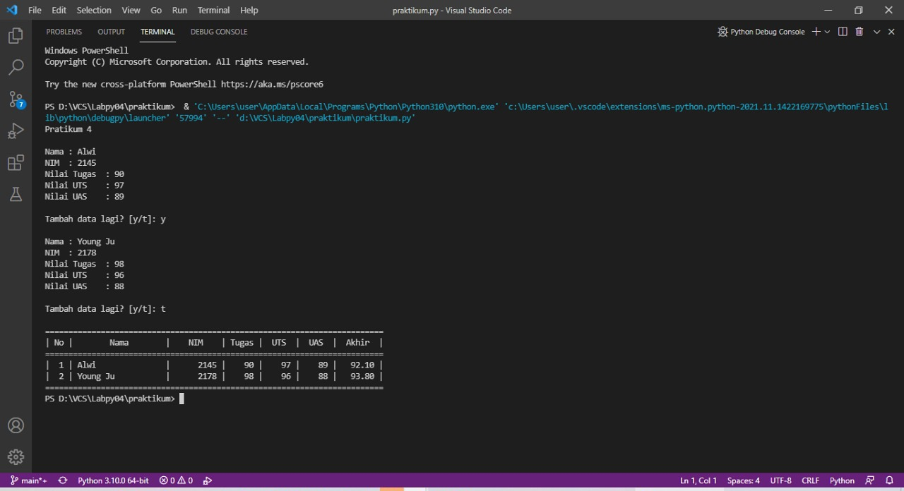

# Praktikum 4

## 1.  Latihan : (Akses/Ubah/Tambah) List
Dalam bahasa pemrograman Python, struktur data yang paling dasar adalah urutan atau list. Setiap elemen-elemen berurutan akan diberi nomor posisi atau index nya. Index pertama dalam list adalah nol, index kedua adalah satu dan seterusnya.

1. Mengakses List

### Penjelasan
1. Membuat list dengan value (nilai) yang diinginkan. Dalam variable <b>negara</b> tersimpan nilai berupa array list yang didalamnya terdapat 6 elemen. Dimulai dari elemen pertama atau indeks ke-0 yaitu “china” dan diakhiri dengan elemen ke-6 atau indeks ke-5 yaitu “kanada”.

	```python
	negara = ['china', 'taiwan', 'korea', 'singapura', 'australia', 'kanada']
    ```

2. Menampilkan semua elemen yang terdapat pada list yang telah dibuat.
	
    ```python
    print("List:", negara)
	```

3. Untuk menampilkan elemen ketiga pada sebuah list, gunakan `negara[3]`. <b>"negara"</b> adalah nama variable dari list yang akan dibuat, sedangkan <b>[3]</b> adalah elemen ketiga karena kita akan menampilkan elemen yang ketiga. <b>Note : Nomor indeks list selalu dimulai dari nol.</b>
	
    ```python
	print("Elemen ke-3 :", negara[3])
	```

4. Jika ingin mengambil elemen kedua sampai keempat, gunakan ` negara[2:4]`.
	```python
	print("Elemen ke-2 sampai elemen ke-4 :", negara[2:4])
	```

5. Dan jika ingin mengambil elemen terakhir, maka gunakan ` negara[-1]`
	
    ```python
	print("Elemen Terakhir :", negara[-1])
	```
### Output


2. Mengubah List

### Penjelasan
1. Membuat list dengan nilai yang diinginkan.
	
    ```python
	negara = ['china', 'taiwan', 'korea', 'singapura', 'australia', 'kanada']
    print("List:", negara)
	```

2. Untuk mengubah elemen ke-4 dengan nilai yang lain, gunakan `negara[4]='jepang'`.

	```python
	negara[4]='jepang'
    print("List sesudah di ubah :", negara)
	```

3. Jika ingin mengubah elemen ke-4 sampai dengan elemen terakhir, gunakan `negara[4:]=["hongkong", "makau"]`.
	
    ```python
	negara[4:]=["hongkong", "makau"]
    print("Ubah element ke-4 hingga akhir :", negara)
	```
### Output


3. Tambah List

### Penjelasan
1. Buat list dengan variable A dan b dengan nilai yang diinginkan.
	
    ```python
	a=[10, 20, 30, 40, 50]
    b=[60, 70, 80, 90, 100]
    ```

2. Untuk mengambil 2 bagian dari list A dan tambahkan di list B, gunakan `b.append(a[0:2])`.

	```python
	b.append(a[0:2])
    print(b)
	```

3. Menambahkan list B dengan nilai string.

	```python
	b.append("25")
    print(b)
	```

4. Menambahkan 3 nilai ke dalam list B.
	```python
	print(b+[26, 27, 28])
    print()
    ```

5. Untuk menggabungkan list B dan list A, gunakan operator “+”.
	
    ```python
	print(a+b)
	```
### Output


## 2. Tugas Praktikum : Menambahkan Data ke dalam List
### Flowchart

### Program

### Penjelasan
1. (Deklarasi list) ketika menginput data, maka data akan dimasukan ke dalam list ini
```python
_nama = []
_nim = []
_tugas = []
_uts = []
_uas = []
_akhir = []
```

2. Membuat program perulangan menggunakan _while loop_ dengan nilai True
```python
while True:
```

3. Pada variabel `_nama.append` dan `_nim.append` inputan akan ditambahkan ke dalam list dengan method `.append`, sedangkan untuk nilai(Tugas, UTS dan UAS) dimasukan ke variable `_akhir.append` terlebih dahulu untuk di jumlahkan
```python
    _nama.append(input("Nama : "))
    _nim.append(input("NIM  : "))
    tugas = int(input("Nilai Tugas  : ")); _tugas.append(tugas)
    uts   = int(input("Nilai UTS    : ")); _uts.append(uts)
    uas   = int(input("Nilai UAS    : ")); _uas.append(uas)
    _akhir.append(tugas * 30/100 + uts * 35/100 + uas * 35/100)
```

4. Program input tanya [y/t], apabila jawaban t atau T, maka program inputan dihentikan statement `break` dan akan menampilkan data yang sudah diinput
```python
_tanya = input("Tambah data lagi? [y/t]: ")
    print()
    if(_tanya == "t" or _tanya =="T"):
        break
```

5. Untuk membuat header table, menggunakan `print(73*"=")`, fungsinya membuat "=" sebanyak 73 sebagai garis, dan menggunakan format string agar terlihat rapih. 
```python
print(73*"=")
print("| {0:^2} | {1:^18} | {2:^9} | {3:^5} | {4:^5} | {5:^5} | {6:^7} |".format("No", "Nama", "NIM", "Tugas", "UTS", "UAS", "Akhir"))
print(73*"=")
```

6. Deklarasi `no = 0` untuk membuat nomor pada isi table, lalu membuat perulangan dengan `for`
- Perulangan `nama, nim, tugas, uts, uas`, sesuai urutan yang ada di dalam `zip`
- Pada list yang dimaksud, `in zip` berfungsi untuk membungkus semua list
```python
no = 0
for nama, nim, tugas, uts, uas, akhir in zip(_nama, _nim, _tugas, _uts, _uas, _akhir):
```

7. Membuat isi table sesuai dengan inisialisi diatas, dengan format string agar terlihat rapih
```python
no += 1    
    print("| {0:>2} | {1:<18} | {2:>9} | {3:>5} | {4:>5} | {5:>5} | {6:>7.2f} |".format(no, nama, nim, tugas, uts, uas, akhir))
```

8. Untuk membuat footer atau garis paling bawa ketika looping isi table selesai
```python
print(73*"=")
```

### Output


# SELESAI
# TERIMAKASIH
# 감사합니다